# Формулировка задачи

[[Расширенная грамматика|Расширив]] грамматику $G$, построить ее [[LR(0)-автомат]]:

$$
G = \{ D \to L:T, L \to L;a | a, T \to i \}
$$

# Решение

## Построение [[Расширенная грамматика|расширенной грамматики]] $G'$ по $G$

Соответствующая $G$ расширенная грамматика $G'$ строится по [[Расширенная грамматика|определению]]

$$
G' = \{S \to D,  D \to L:T, L \to L;a | a, T \to i \}
$$

## Построение [[LR(0)-автомат|LR(0)-автомата]] по грамматике $G'$

Построим по определению

![[LR(0)-автомат]]

![[Автомат LR(0)-пунктов]]

Построим [[Автомат LR(0)-пунктов]], сразу замыкая состояния по $\varepsilon$ в одно состояние

```mermaid
stateDiagram-v2
    [*] --> S
    S --> D : D
    S --> L : L
    S --> a1 : a
    L --> #58; : #58;
    L --> ; : #59;
    #58; --> T : T
    #58; --> i : i
    ; --> a2 : a

    classDef finalState fill:#c8e6c9,stroke:#4caf50,stroke-width:3px
    
    class D finalState
    class a1 finalState
    class T finalState
    class i finalState
    class a2 finalState
```

- $S = \{ [S \to  \bullet D], [D \to \bullet L : T], [L \to \bullet L ; a], [L \to \bullet a] \}$
- $D = \{[S \to D \bullet] \}$
- $L = \{[D \to L \bullet : T], [L \to \bullet ; a] \}$
- $a_1 = \{[L \to a \bullet] \}$
- $: = \{[D \to L: \bullet T],[T \to \bullet i] \}$
- $; = \{[L \to L ; \bullet a]\}$
- $T = \{[D \to L:T \bullet] \}$
- $i = \{[T \to i \bullet ]\}$
- $a_2 = \{[L \to L ;a \bullet]\}$

$G'$ является [[LR(0)-грамматика|LR(0)-грамматикой]]. Поэтому можем построить ее [[LR(0)-анализатор]] с использованием алгоритма [[Алгоритм. Построение LR(0)-анализатора|построения LR(0)-анализатора]]

## Построение [[LR(0)-анализатор|LR(0)-анализатора]] для грамматики $G'$

![[LR(0)-анализатор]]

![[LR-анализатор]]

![[Алгоритм. Построение LR(0)-анализатора]]

Нумерация правил грамматики

1. $S \to D$
2. $D \to L : T$  
3. $L \to L ; a$
4. $L \to a$
5. $T \to i$

| Состояние | ACTION           |                |                |                |             | GOTO |     |     |
| --------- | ---------------- | -------------- | -------------- | -------------- | ----------- | ---- | --- | --- |
|           | $a$              | $;$            | $:$            | $i$            | $\dashv$    | $D$  | $L$ | $T$ |
| **$S$**   | $\leftarrow a_1$ | $e_1$          | $e_1$          | $e_1$          | $e_2$       | $D$  | $L$ |     |
| **$D$**   | $e_8$            | $e_8$          | $e_8$          | $e_8$          | $\sqrt{}$   |      |     |     |
| **$L$**   | $e_3$            | $\leftarrow ;$ | $\leftarrow :$ | $e_4$          | $e_5$       |      |     |     |
| **$T$**   | $\otimes 2$      | $\otimes 2$    | $\otimes 2$    | $\otimes 2$    | $\otimes 2$ |      |     |     |
| **$a_1$** | $\otimes 4$      | $\otimes 4$    | $\otimes 4$    | $\otimes 4$    | $\otimes 4$ |      |     |     |
| **$a_2$** | $\otimes 3$      | $\otimes 3$    | $\otimes 3$    | $\otimes 3$    | $\otimes 3$ |      |     |     |
| **$;$**   | $\leftarrow a_2$ | $e_6$          | $e_6$          | $e_6$          | $e_6$       |      |     |     |
| **$:$**   | $e_7$            | $e_7$          | $e_7$          | $\leftarrow i$ | $e_7$       |      |     | $T$ |
| **$i$**   | $\otimes 5$      | $\otimes 5$    | $\otimes 5$    | $\otimes 5$    | $\otimes 5$ |      |     |     |

- $e_1$ - В начале строки допустим только символ `a`
- $e_2$ - Пустая строка недопустима
- $e_3$ - Символы `a` не могут идти рядом
- $e_4$ - Символы `a` и `i` не могут стоять рядом
- $e_5$ - Строка не может закончиться символом `a`
- $e_6$ - После `i` может идти только символ `a`
- $e_7$ - После символа `:` может следовать только `i`
- $e_8$ - После символа `i` не могут стоять символы
