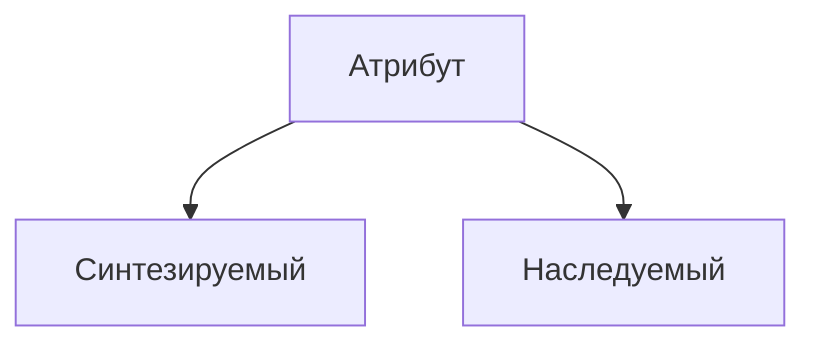

# Вступление

## Цели [[Семантический анализ|семантического анализа]]

> [[Слово]] - текст компьютерной программы

1. Проверка корректности программы на более глубоком уровне, чем обычный анализ средствами [[Контекстно-свободная грамматика|контекстно-свободных]] грамматик
2. Сбор и систематизация дополнительной информации о программе
3. [[Атрибутная грамматика]] - расширение [[Контекстно-свободная грамматика|контекстно-свободной грамматики]]

# Основные понятия

![[Грамматический символ]]

![[Атрибут грамматического символа]]

![[Домен атрибута грамматического символа]]

Для [[Порождающая грамматика|терминального символа]] $t \in \Sigma$ в качестве [[Атрибут грамматического символа|атрибута]] используется только его лексическое значение, хранимое в таблице символов. Имя такого атрибута может быть, например `lexval`. Тогда факт, что терминальный символ $t$ имеет атрибут с именем $lexval$ записывают следующим образом через точку:

$$
t.lexval
$$

Для [[Порождающая грамматика|нетерминального символа]], например $А \in \Gamma$ его атрибут с именем $val$ может быть записан аналогично:

$$
A.val
$$

![[Семантическое правило]]

Выделяют 2 класса атрибутов: синтезируемые и наследуемые

![[Синтезируемый атрибут]]

![[Наследуемый атрибут]]

![[Атрибутная грамматика]]

**Замечание:** Грамматику $G$ можно преобразовать в атрибутную многими способами

> [[Контекстно-свободная грамматика]] легко достраивается до [[Атрибутная грамматика|атрибутной]] добавлением в набор пустого множества [[Атрибут грамматического символа|атрибутов]] и пустого множества [[Семантическое правило|семантических правил]]

![[Аннотированное дерево вывода слова]]

**Замечание:**

>В [[Аннотированное дерево вывода слова|аннотированном дереве]] [[Синтезируемый атрибут|синтезируемый атрибут]] $A.s$ зависит от значений атрибутов сыновей узла $A$. Следовательно, значения всех [[Синтезируемый атрибут|синтезируемых атрибутов]] вычисляются снизу-вверх.
>[[Наследуемый атрибут]] $A.i$ зависит от значений атрибутов отца узла $A$, или от значений атрибутов братьев узла $A$. Следовательно, его значение вычисляется либо «сверху-вниз», либо комбинированным способом обхода дерева.

# Пример построения [[Атрибутная грамматика|атрибутной грамматики]]

> стр. 186 из учебного пособия А.Ф. Шура и А.П. Замятина

В качестве [[Контекстно-свободная грамматика|КС-грамматики]] возьмем 

$$
G = \{ E \to E + T | T, T \to T * F | F, E \to (E)|x \}
$$

^attribute-grammar

В качестве множества [[Атрибут грамматического символа|атрибутов]]:

- $E.val, T.val, F.val$ - значение арифметического выражения
- $x.val$ - лексическое значение $x$

В качестве множества [[Семантическое правило|семантических правил]] (принято записывать в виде таблицы):

| Номер правила вывода | [[Порождающая грамматика\|Правило вывода]] | [[Семантическое правило]]  |
| -------------------- | ------------------------------------------ | -------------------------- |
| 1                    | $E \to E_1 + T$                            | $E.val := E_1.val + T.val$ |
| 2                    | $E \to T$                                  | $E.val := T.val$           |
| 3                    | $T \to T_1 * F$                            | $T.val := T_1.val + F.val$ |
| 4                    | $T \to F$                                  | $T.val := F.val$           |
| 5                    | $F \to  (E)$                               | $F.val := E.val$           |
| 6                    | $F \to x$                                  | $F.val := x.lexval$        |

# Пример построения [[Аннотированное дерево вывода слова|аннотированного дерева]] по [[Атрибутная грамматика|атрибутной грамматике]]

По [[Атрибутная грамматика|атрибутной грамматике]] $G$, построенной [[#Пример построения Атрибутная грамматика атрибутной грамматики|выше]], построим [[Аннотированное дерево вывода слова|аннотированное дерево вывода]] арифметического выражения $2 + 5 * 3$

**[[Дерево вывода слова|дерево вывода]]**

![[Pasted image 20251026222222.png]]

^tree

**[[Аннотированное дерево вывода слова]]**

![[Pasted image 20251026222244.png]]

^annotated-tree
