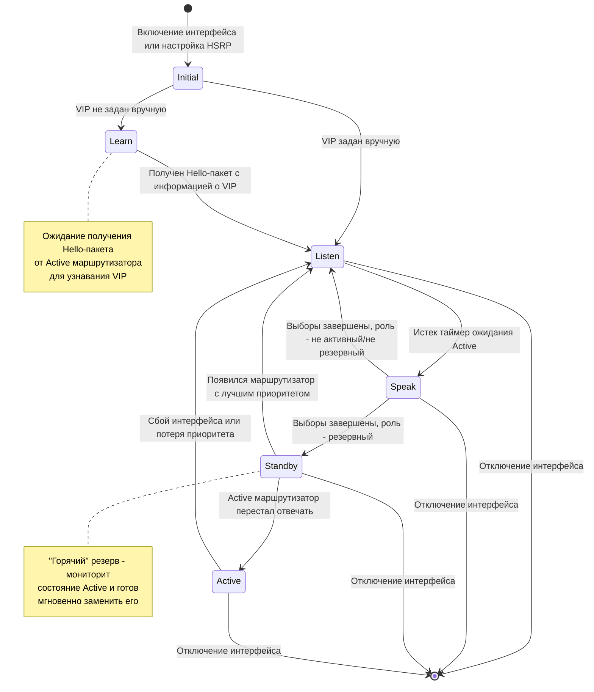
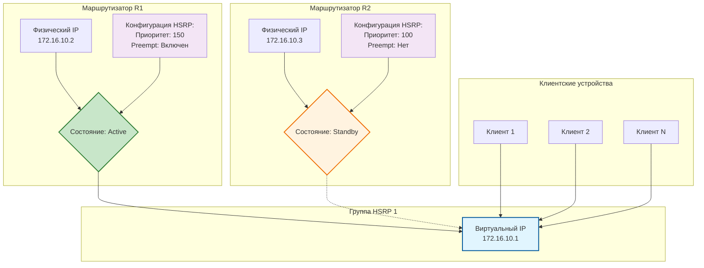

# EtherChannel

## Агрегация трафика

![[Pasted image 20251009154655.png]]

>- Необходимо отправлять весь трафик с уровня access на уровень distribution
>- Необходимо быстрое соединение между access и distribution
>- Соединение коммутаторов быстрым каналом связи
>**НО:**
STP блокирует избыточные каналы связи

[[Сети. Лекция 13. Spanning-Tree Protocol (STP)|STP]] срезает пропускную способность каналов, когда строит дерево и отключает часть сегментов сети, чтобы построить дерево. Заблокированные каналы можно было бы использовать, если считать несколько каналов между 2 коммутаторами за один канал. Такую возможность предоставляет EtherChannel

## Про EtherChannel

![[Pasted image 20251009155832.png]]

- Технология cisco (стандартизирована)
- Объединяет несколько каналов FastEthernet или GigabitEthernet в один логический канал связи (объединение только портов с одной скоростью)
- Создаётся виртуальный интерфейс PortChannel
- Настройки на PortChannel распространяются на все каналы внутри него
- Балансировка нагрузки между портами
- **Каналы в EtherChannel не блокируются STP**
- Продолжает работать, пока не остается в рабочем состоянии хотя бы один канал, включенный в интерфейс (закрываем доступ через избыточность)
- Протоколы PAgP и LACP

## Ограничения EtherChannel

![[Pasted image 20251009160310.png]]

- Можно использовать только порты одного типа (FastEthernet или GigabitEthernet)
- До 8 портов в одном EtherChannel
- До 6 EtherChannel-групп (чисто физические ограничения на число портов коммутатора)
- Соединяет только два устройства
- Может быть между:
	- двумя коммутаторами
	- коммутатором и хостом с поддержкой технологии
- Требует совместимой настройки портов обоих устройств

## PAgP - Port Aggregation Protocol

![[Pasted image 20251009160918.png]]

| S1        | S2             | Channel Establishment |
| --------- | -------------- | --------------------- |
| On        | On             | Yes                   |
| On        | Desirable/Auto | No                    |
| Desirable | Desirable      | Yes                   |
| Desirable | Auto           | Yes                   |
| Auto      | Desirable      | Yes                   |
| Auto      | Auto           | No                    |

- **Производитель:** Cisco
- **Назначение:** Для автоматического создания EtherChannel с помощью согласований
- **Работа:** Пакеты PAgP отправляются каждые 30 сек. для поддержания канала
- **Требования:** Одинаковые скорость, дуплекс, набор VLAN
- **Функции:** 
  - Проверяет однородность настроек
  - Отслеживает добавление и отключение портов
- **Режимы:** On, Desirable, Auto

---

- *On* - не нужно согласовывать EtherChannel (статическая настройка)
- *Desirable* - активное согласование каналов
- *Auto* - Лишь принимает сообщения (от Desirable режима)

## LACP - Link Aggregation Control Protocol

![[Pasted image 20251009161414.png]]

Та же задача, но стандарт протокола открытый

| S1      | S2             | Channel Establishment |
| ------- | -------------- | --------------------- |
| On      | On             | Yes                   |
| On      | Active/Passive | No                    |
| Active  | Active         | Yes                   |
| Active  | Passive        | Yes                   |
| Passive | Active         | Yes                   |
| Passive | Passive        | No                    |

### LACP (Link Aggregation Control Protocol)

- **Стандарт:** IEEE 802.3ad (IEEE 802.1AX)
- **Назначение:** Для автоматического создания логического канала связи с помощью согласований
- **Функции:**
  - Проверяет однородность настроек
  - Отслеживает добавление и отключение портов
- **Особенность:** Поддерживает 8 резервных каналов
- **Режимы:** **On, Active, Passive**

Резервные каналы начинают работать, если часть каналов в интерфейсе сломалось

## Настройка PAgP

**Создание PortChannel:**

```cisco
S(config)# interface range interface
S(config-if-range)# channel-group <identifier> mode [desirable | auto | on]
```

**Настройка PortChannel:**

```cisco
S(config)# interface port-channel number
S(config-if)# ...
```

>**Примечание:** Выключен по умолчанию

## Настройка LACP

**Создание PortChannel:**

```cisco
S(config)# interface range interface
S(config-if-range)# channel-group identifier mode [active | passive | on]
```

**Настройка PortChannel:**

```cisco
S(config)# interface port-channel number
S(config-if)# …
```

>**Примечание:** Выключен по умолчанию

==Где различия?==

## Пример настройки

![[Pasted image 20251009162615.png]]

```cisco
S1(config)# interface range FastEthernet0/1 - 2
S1(config-if-range)# channel-group 1 mode active
Creating a port-channel interface Port-channel 1
S1(config-if-range)# interface port-channel 1
S1(config-if)# switchport trunk encapsulation dot1q
S1(config-if)# switchport mode trunk
S1(config-if)# switchport trunk allowed vlan 1,2,20
```

## Мониторинг

**Общие настройки:**

```cisco
S# show interfaces port-channel number
```

**Если несколько EtherChannel, общая информация:**

```cisco
S# show etherchannel summary
```

**Подробная информация по конкретному каналу:**

```cisco
S# show etherchannel port-channel
```

**Информация для интерфейса:**

```cisco
S# show interfaces type number etherchannel
```

### Пример вывода show interfaces port-channel 

```cisco
S1# show interfaces port-channel 1
Port-channel1 is up, line protocol is up (connected)
Hardware is EtherChannel, address is 0cd9.96e8.8a02 (bia 0cd9.96e8.8a02)
MTU 1500 bytes, BW 200000 Kbit/sec, DLY 100 usec,
    reliability 255/255, txload 1/255, rxload 1/255
Encapsulation ARPA, loopback not set
< output omitted >
```

- Интерфейс Port-channel1 активен (`up`)
- Агрегированная пропускная способность: 200000 Kbit/sec (2×100 Mbps)
- Адрес MAC: 0cd9.96e8.8a02

### Пример вывода show etherchannel summary

```cisco
S# show etherchannel summary
Flags: D - down        P - bundled in port-channel
       I - stand-alone s - suspended
       H - Hot-standby (LACP only)
       R - Layer3      S - Layer2
       U - in use      f - failed to allocate aggregator
       M - not in use, minimum links not met
       u - unsuitable for bundling
       w - waiting to be aggregated
       d - default port

Number of channel-groups in use: 1
Number of aggregators:           1

Group  Port-channel  Protocol  Ports
------+-------------+---------+-----------------
1      Po1(SU)       LACP      Fa0/1(P)  Fa0/2(P)
```

- **Po1(SU)**: Port-channel 1 активен (Layer2, in use)
- **Protocol**: LACP
- **Fa0/1(P), Fa0/2(P)**: Оба порта объединены в port-channel

### Пример вывода show etherchannel port-channel

```cisco
S# show etherchannel port-channel
Channel-group listing:
---
Group: 1
---
Port-channels in the group:
---
Port-channel: Po1    (Primary Aggregator)
---
Age of the Port-channel = 0d:06h:23m:49s
Logical slot/port = 2/1    Number of ports = 2
HotStandBy port = null
Port state    = Port-channel Ag-Inuse
Protocol    = LACP
Port security    = Disabled

Ports in the Port-channel:

Index   Load   Port   EC state   No of bits
------+------+-------+-----------+-----------
0      55     Fa0/1   Active     4
1      45     Fa0/2   Active     4

Time since last port bundled:    0d:05h:52m:59s   Fa0/2
Time since last port Un-bundled: 0d:05h:53m:05s   Fa0/2
```

### Пример вывода show interfaces interface_number etherchannel

```cisco
S# show interfaces f0/1 etherchannel
Port state = Up Mstr In-Bndl 
Channel group = 1    Mode = Active    Gcchange = -
Port-channel = Po1    GC = -    Pseudo port-channel = Po1
Port index = 0    Load = 0x00    Protocol = LACP

Flags: S - Device is sending Slow LACPDUs F - Device is sending fast LACPDUs
       A - Device is in active mode.    P - Device is in passive mode.

Local information:
| Port  | Flags | LACP port | Admin | Oper  | Port  | Port  |
|-------|-------|-----------|-------|-------|-------|-------|
|       |       | State     | Priority | Key  | Key   | Number | State |
| Fa0/1 | SA    | bndl      | 32768    | 0x1  | 0x1   | 0x102  | 0x3D  |
Partner's information:
| Port  | Flags | LACP port |       | Admin | Oper  | Port  | Port  |
|-------|-------|-----------|-------|-------|-------|-------|-------|
|       |       | Priority  | Dev ID | Age   | Key   | Key   | Number | State |
| Fa0/1 | SA    | 32768     | 0cd9.96d2.4000 | 13s | 0x0   | 0x1   | 0x102  | 0x3D  |
Age of the port in the current state: 0d:06h:06m:51s
```

## Отладка EtherChannel

![[Pasted image 20251009163842.png]]

- **VLAN:** Порты EtherChannel в одной VLAN?
- **Trunk:** Согласованная настройка Trunk? Одинаковая Native VLAN? Одинаковые диапазоны разрешённых VLAN?
- **Конфигурация:** Все порты в EtherChannel одинаково настроены?
- **Протокол:** Совместимые режимы портов для PAgP или LACP?

> Если используем EtherChannel, все настройки портов проводим при настройке EtherChannel, в который эти порты входят

## Внесение изменений в EtherChannel

Пересоздаем EtherChannel для переконфигурации EtherChannel

```cisco
S1(config)# no interface port-channel 1
S1(config)# interface range fa0/1 - 2
S1(config-if-range)# channel-group 1 mode desirable
Creating a port-channel interface Port-channel 1
S1(config-if-range)# no shutdown
S1(config-if-range)# exit
S1(config)# interface range fa0/1 - 2
S1(config-if-range)# channel-group 1 mode desirable
S1(config-if-range)# no shutdown
S1(config-if-range)# interface port-channel 1
S1(config-if)# switchport mode trunk
S1(config-if)# end
```

# FHRP

## Резервирование Default Gateway

![[Pasted image 20251013235909.png]]

* **Только один шлюз на устройство:** В конфигурации без FHRP (например, стандартный протокол маршрутизации) каждое конечное устройство (ПК, сервер) знает и использует только один IP-адрес шлюза по умолчанию. Если этот шлюз выходит из строя, устройство не может автоматически переключиться на другой.
* **Недоступность других сетей при поломке шлюза:** Прямое следствие первой проблемы. Если единственный известный шлюз становится недоступным, все соединения за пределы локальной сети (в другие сегменты сети, в интернет) становятся невозможными, даже если в сети есть другие работающие маршрутизаторы.

**FHRP (First Hop Redundancy Protocol)** — это общее название для семейства протоколов (таких как HSRP, VRRP, GLBP), которые решают именно эти проблемы

## Сбой маршрутизатора

![[Pasted image 20251014000240.png]]

![[Pasted image 20251014000723.png]]

* **Имеет свои IP и MAC:** Виртуальный маршрутизатор — это логическая, а не физическая сущность. Ему назначается собственный виртуальный IP-адрес (Virtual IP, VIP) и виртуальный MAC-адрес, которые известны всем конечным устройствам в сети.
* **Выполняет роль шлюза для конечных устройств:** Конечные устройства (ПК, серверы) настраиваются использовать виртуальный IP-адрес в качестве шлюза по умолчанию. Весь трафик за пределы локальной сети они отправляют на этот виртуальный адрес.
* **Redundancy protocol определяет активный физический маршрутизатор и включает резервный:** Протоколы избыточности первого хопа (FHRP), такие как HSRP или VRRP, работают "за кулисами" виртуального маршрутизатора. Они отвечают за выбор того, какой из физических маршрутизаторов в группе будет активным (Active/Forwarder) и обрабатывать трафик, адресованный виртуальному IP. Остальные маршрутизаторы находятся в резервном (Standby) состоянии и готовы мгновенно взять на себя роль, если активный выйдет из строя.
* **first-hop redundancy:** Это основная цель создания виртуального маршрутизатора — обеспечить отказоустойчивость на "первом прыжке" (first hop) от конечного устройства в сеть.

**Что такое Виртуальный Маршрутизатор?**

**Виртуальный маршрутизатор** — это ключевая логическая абстракция в протоколах FHRP. Он представляет собой единую точку входа (шлюз) для клиентских устройств, в то время как на физическом уровне за ним скрывается группа из нескольких реальных маршрутизаторов, обеспечивающая избыточность и высокую доступность.

**Как это работает на практике?**

1. Администратор настраивает группу FHRP на двух или более физических маршрутизаторах, задавая им один и тот же виртуальный IP (VIP).
2. Конечные устройства в сети настраиваются использовать этот VIP в качестве шлюза по умолчанию.
3. Протокол FHRP автоматически выбирает, какой физический маршрутизатор будет активным и "отвечать" за VIP в данный момент.
4. Для клиентов шлюз всегда один и тот же (VIP), независимо от того, какой физический маршрутизатор активен. Смена активного устройства происходит автоматически и незаметно для пользователей.

> Виртуальный адрес лежит в той же подсети, что и адреса маршрутизаторов в группе

## Семейство протоколов FHRP

![[Pasted image 20251014000858.png]]


**Комментарии к изображению: Обзор протоколов FHRP**

Изображение представляет собой схему, классифицирующую основные протоколы избыточности первого хопа (FHRP).

**Протоколы Cisco**

* **Hot Standby Router Protocol (HSRP)**
    * **Описание:** Проприетарный протокол компании Cisco.
    * **Ключевые особенности:**
        * **Прозрачное восстановление:** Обеспечивает автоматическое и незаметное для конечных устройств переключение на резервный маршрутизатор при отказе основного.
        * **Роли: Active и Standby:** В группе один маршрутизатор активен (обрабатывает трафик), а другой находится в режиме горячего резерва (Standby) и готов мгновенно заменить активный.
* **HSRP for IPv6**
    * **Описание:** Адаптация протокола HSRP для работы в сетях IPv6.
    * **Ключевая особенность:** Использует виртуальный link-local адрес в качестве адреса шлюза для конечных устройств, что соответствует идеологии IPv6.
* **Gateway Load Balancing Protocol (GLBP)**
    * **Описание:** Проприетарный протокол Cisco.
    * **Ключевая особенность:** В отличие от HSRP и VRRP, которые обеспечивают только резервирование, GLBP позволяет производить **балансировку нагрузки** трафика между несколькими маршрутизаторами в группе, повышая общую производительность.
* **GLBP for IPv6**
    * **Описание:** Версия протокола GLBP для сетей IPv6.


**Стандартные протоколы (IETF)**

* **Virtual Router Redundancy Protocol version 2 (VRRPv2)**
    * **Описание:** Открытый стандарт (RFC 3768), что позволяет обеспечивать избыточность шлюза между оборудованием разных производителей.
    * **Ключевые особенности:**
        * **Динамически определяет активный роутер:** Мастер-маршрутизатор (Master) выбирается динамически на основе приоритета.
        * **Роли: Master и Backup:** Аналогичны ролям Active/Standby в HSRP.
* **VRRPv3**
    * **Описание:** Обновленная версия VRRP.
    * **Ключевые особенности:**
        * **Поддержка IPv4 и IPv6:** Универсальная версия, работающая с обоими сетевыми протоколами.
        * **Повышенная масштабируемость:** Внесены улучшения по сравнению с VRRPv2 для лучшей работы в крупных сетях.


**Другие протоколы**

* **ICMP Router Discovery Protocol (IRDP)**
    * **Описание:** Стандартный протокол (RFC 1256), который не является полноценным FHRP, но решает смежную задачу.
    * **Ключевая особенность:** Позволяет конечным устройствам автоматически обнаруживать доступные маршрутизаторы (шлюзы) в сети без статической настройки.

## HSRP

![[Pasted image 20251014001330.png]]

Изображение детализирует ключевые аспекты функционирования протокола Hot Standby Router Protocol (HSRP).

* **Есть две версии протокола**
    * **Версия 1 (HSRPv1):** Использует multicast-адрес `224.0.0.2` и номер группы 0-255.
    * **Версия 2 (HSRPv2):** Использует multicast-адрес `224.0.0.102` и позволяет использовать группу в диапазоне 0-4095. HSRPv2 также улучшает поддержку IPv6 и предоставляет более детальную информацию о состоянии интерфейса.
* **Выбор активного маршрутизатора (Active Router)**
    * **Правило:** Активным выбирается маршрутизатор с **наибольшим приоритетом**.
    * **Приоритет по умолчанию:** 100 (диапазон от 0 до 255).
    * **Команда настройки:** `standby [group-number] priority [value]`
    * **Разрешение коллизий:** Если приоритеты равны, активным становится маршрутизатор с **наибольшим IP-адресом** на интерфейсе, где настроен HSRP.
* **Режим преэмпции (Preempt)**
    * **Проблема:** Без восстановлении роль Active маршрутизатора не **не меняется автоматически**, даже если в сеть вернется маршрутизатор с более высоким приоритетом.
    * **Решение:** Команда `standby [group-number] preempt` позволяет маршрутизатору с высшим приоритетом **немедленно вернуть** себе роль Active, как только он станет доступен. Это критически важная настройка для предсказуемого восстановления.

>Eсли приоритеты равны, перевыборов не происходит даже если ip-адрес активного маршрутизатора больше остальных в группе

* **Обмен сообщениями (Hello Packets)**
    * **Назначение:** Маршрутизаторы в группе HSRP обмениваются Hello-пакетами для выборов активного устройства и поддержания информации о состоянии друг друга.
    * **Multicast-рассылка:** Пакеты отправляются на групповой адрес (`224.0.0.2` для v1, `224.0.0.102` для v2).
    * **Интервал по умолчанию:** 3 секунды.
* **Таймеры (Timers)**
    * **Hold Timer (Таймер удержания):** 10 секунд. Это время, в течение которого маршрутизатор будет ждать Hello-пакет от Active, прежде чем объявить его недоступным и инициировать выборы нового Active.
* **Конфигурация**
    * **Область настройки:** HSRP настраивается на **интерфейсе** уровня L3 (VLAN interface, физический интерфейс), который подключен к защищаемой сети.

> Все маршрутизаторы должны относиться к одному номеру группы

## Версии HSRP

| Характеристика                   | HSRP версии 1 (по умолчанию)                                                               | HSRP версии 2                                                                                                                           |
| :------------------------------- | :----------------------------------------------------------------------------------------- | :-------------------------------------------------------------------------------------------------------------------------------------- |
| **Номера группы**                | От 0 до 255<br>До 256 групп на интерфейс                                                   | **От 0 до 4095**<br>**Значительно больше групп** (4096) на интерфейс                                                                    |
| **Адрес многоадресной рассылки** | **224.0.0.2**<br>Последние 2 цифры номера группы                                           | **224.0.0.102** (IPv4)<br>**FF02::66** (IPv6)<br>Последние 3 цифры номера группы                                                        |
| **Виртуальный MAC-адрес**        | 0000.0C07.AC_XX_<br>(XX — номер группы в HEX)<br>Диапазон: 0000.0C07.AC00 – 0000.0C07.ACFF | **IPv4:** 0000.0C9F.F_XXX_<br>**IPv6:** 0005.73A0._XXX_<br>(XXX — номер группы в HEX)<br>**Новые диапазоны**, отдельные для IPv4 и IPv6 |
| **Поддержка аутентификации MD5** | **Нет**<br>Только простой текстовый пароль                                                 | **Да**<br>**Повышенная безопасность** благодаря хэшированию                                                                             |

1. **Масштабируемость:** HSRPv2 значительно превосходит v1 по количеству доступных групп (4095 против 255), что критически важно для крупных и сложных сетей.
2. **Безопасность:** HSRPv2 добавляет поддержку аутентификации MD5, что защищает от несанкционированного присоединения к группе HSRP и перехвата роли Active.
3. **Изоляция трафика:** Использование уникального multicast-адреса в HSRPv2 предотвращает возможную обработку его пакетов другими процессами, которые "слушают" адрес 224.0.0.2.
4. **Поддержка IPv6:** HSRPv2 имеет встроенную поддержку IPv6, включая свой собственный multicast-адрес и диапазон MAC-адресов, что делает HSRPv1 устаревшим для современных сетей.

**Рекомендация:** Для всех новых развертываний следует использовать **HSRP версии 2** из-за его повышенной безопасности, масштабируемости и полноценной поддержки IPv6.

## Состояния HSRP

| Состояние HSRP              | Описание                                                                                                                                                                                                                                                                                                                                     |
| :-------------------------- | :------------------------------------------------------------------------------------------------------------------------------------------------------------------------------------------------------------------------------------------------------------------------------------------------------------------------------------------- |
| **Initial (Инициализация)** | Начальное состояние. Возникает при **первой настройке HSRP**, изменении конфигурации интерфейса или когда сам интерфейс становится активным (up). Маршрутизатор начинает процесс перехода в рабочее состояние.                                                                                                                               |
| **Learn (Обучение)**        | В этом состоянии маршрутизатор **еще не знает Виртуальный IP (VIP)** адрес и **ждет первого Hello-пакета** от действующего Активного (Active) маршрутизатора, чтобы узнать от него VIP.                                                                                                                                                      |
| **Listen (Прослушивание)**  | Маршрутизатору **известен Виртуальный IP-адрес**, но он **не является ни Активным (Active), ни Резервным (Standby)**. Он пассивно прослушивает Hello-пакеты от других маршрутизаторов в группе, отслеживая состояние Active и Standby. В этом состоянии находится большинство маршрутизаторов в группе, если их больше двух.                 |
| **Speak (Разговор)**        | Маршрутизатор начинает **активно участвовать в процессе**. Он **периодически отправляет свои собственные Hello-пакеты** и объявляет о своем приоритете. Это состояние необходимо для участия в **выборах** на роль Активного или Резервного маршрутизатора.                                                                                  |
| **Standby (Резервный)**     | Маршрутизатор был избран на роль **"горячего" резерва**. Он **периодически отправляет Hello-пакеты** и **мониторит состояние Активного маршрутизатора**. В случае выхода Active из строя, маршрутизатор в состоянии Standby **немедленно возьмет на себя его роль**. В группе HSRP может быть только один маршрутизатор в состоянии Standby. |

*Сгенерировано нейросетью*



## Настройка HSRP

**Включение HSRP версии 2**
По умолчанию используется версия 1. Этой командой она явно меняется на версию 2.

```cisco
S(config-if) # standby version 2
```

**Настройка виртуального IP-адреса (Virtual IP)**

```cisco
S(config-if) # standby [group-number] ip [ip-address]
```

- `[group-number]` — номер группы HSRP
- `[ip-address]` — виртуальный IP-адрес группы.

**Настройка приоритета**

```cisco
S(config-if) # standby [group-number] priority [priority-value]
```

- `[group-number]` — номер группы HSRP
- `[priority-value]` — приоритет

**Настройка Preempt**

```cisco
S(config-if) # standby [group-number] preempt
```

- `[group-number]` — номер группы HSRP

**Настройка имени группы**

```cisco
S(config-if) # standby [group-number] name [group-name]
```

- `[group-number]` — номер группы HSRP
- `[group-name]` — имя группы HSRP

## Пример настройки HSRP

```cisco
R1(config)# interface g0/1
R1(config-if)# ip address 172.16.10.2 255.255.255.0
R1(config-if)# standby version 2
R1(config-if)# standby 1 ip 172.16.10.1
R1(config-if)# standby 1 priority 150
R1(config-if)# standby 1 preempt
R1(config-if)# no shutdown

```

```cisco
R2(config)# interface g0/1
R2(config-if)# ip address 172.16.10.3 255.255.255.0
R2(config-if)# standby version 2
R2(config-if)# standby 1 ip 172.16.10.1
R2(config-if)# no shutdown
```



## Мониторинг HSRP

### show standby

Команда `show standby` используется для проверки состояния и конфигурации HSRP на интерфейсе маршрутизатора Cisco.

```cisco
R1# show standby
GigabitEthernet0/1 - Group 1 (version 2)
    State is Active
    5 state changes, last state change 01:02:18
    Virtual IP address is 172.16.10.1
    Active virtual MAC address is 0000.0c9f.f001
    Local virtual MAC address is 0000.0c9f.f001 (v2 default)
    Hello time 3 sec, hold time 10 sec
    Next hello sent in 1.120 secs
    Preemption enabled
    Active router is local
    Standby router is 172.16.10.3, priority 100 (expires in 9.392 sec)
    Priority 150 (configured 150)
    Group name is "hsrp-Gi0/1-1" (default)
R1#
```

```cisco
R2# show standby
GigabitEthernet0/1 - Group 1 (version 2)
    State is Standby
    5 state changes, last state change 01:03:59
    Virtual IP address is 172.16.10.1
    Active virtual MAC address is 0000.0c9f.f001
    Local virtual MAC address is 0000.0c9f.f001 (v2 default)
    Hello time 3 sec, hold time 10 sec
    Next hello sent in 0.944 secs
    Preemption disabled
    Active router is 172.16.10.2, priority 150 (expires in 8.160 sec)
    MAC address is fc99.4775.c3e1
    Standby router is local
    Priority 100 (default 100)
    Group name is "hsrp-Gi0/1-1" (default)
R2#
```

### show standby brief

Менее подробная информация

```cisco

R1# show standby brief
P indicates configured to preempt.
|    |    |    |
Interface   Grp  Pri P State   Active       Standby        Virtual IP
Gi0/1       1    150 P Active  local        172.16.10.3    172.16.10.1
R1#
```

```cisco
R2# show standby brief
P indicates configured to preempt.
|    |    |    |
Interface   Grp  Pri P State   Active       Standby        Virtual IP
Gi0/1       1    100   Standby 172.16.10.2  local         172.16.10.1
R2#
```

## Поиск и устранение неполадок HSRP


**Комментарии к изображению: Распространенные неполадки HSRP и их диагностика**

Изображение содержит список типичных проблем, которые могут возникать при настройке и работе протокола HSRP.

---

### **Категории неполадок HSRP**

#### **1. Проблемы выбора и отслеживания состояния**

- **Сбой выбора активного маршрутизатора** — возникает при неправильных настройках приоритета или отсутствии команды `preempt`
- **Сбой отслеживания активного маршрутизатора** — проблемы с получением Hello-пакетов из-за:
  - ACL (Access Control Lists) блокируют multicast-трафик
  - Физические проблемы соединения
  - Неправильные таймеры

#### **2. Проблемы передачи управления**

- **Сбой определения момента передачи управления** — может быть вызван:
  - Неправильными настройками hold-таймера
  - Отсутствием команды `preempt` на резервном маршрутизаторе
  - Разными версиями HSRP на маршрутизаторах

#### **3. Проблемы конфигурации клиентов**

- **Сбой установки виртуального IP-адреса как шлюза** — клиенты не знают о виртуальном шлюзе или используют неправильный адрес

#### **4. Критические ошибки конфигурации сети**

- **Маршрутизаторы HSRP в разных сегментах сети** — должны находиться в одном broadcast-домене (одна VLAN/подсеть)
- **Разные подсети IPv4** — физические IP-адреса должны быть из одной подсети
- **Разные виртуальные адреса IPv4** — VIP должен быть одинаковым для всех участников группы
- **Разные номера группы HSRP** — маршрутизаторы не смогут образовать группу

## debug standby

```cisco
R2# debug standby ?
  errors    HSRP errors
  events    HSRP events
  packets   HSRP packets terse
  Display limited range of HSRP errors, events and packets <cr>
```

> Не забыть выключить

## Пример работы debug standby packets

```cisco
R2# debug standby packets
*Dec 2 15:20:12.347: HSRP: Gio/1 Grp 1 Hello in 172.16.10.2 Active pri 150 vIP 172.16.10.1
*Dec 2 15:20:12.643: HSRP: Gio/1 Grp 1 Hello out 172.16.10.3 Standby pri 100 vIP 172.16.10.1
```

## Пример работы debug standby terse

**Потеря связи с active маршрутизатором, переход в состояние active**

```cisco
R2# debug standby terse
HSRP:
    HSRP Errors debugging is on
    HSRP Events debugging is on
    (protocol, neighbor, redundancy, track, arp, interface)
    HSRP Packets debugging is on
    (Coup, Resign)

R2#
*Dec 2 16:11:31.855: HSRP: G10/1 Grp 1 Standby: c/Active timer expired (172.16.10.2)
*Dec 2 16:11:31.855: HSRP: G10/1 Grp 1 Active router is local, was 172.16.10.2
*Dec 2 16:11:31.855: HSRP: G10/1 Nbr 172.16.10.2 no longer active for group 1 (Standby)
*Dec 2 16:11:31.855: HSRP: G10/1 Nbr 172.16.10.2 Was active or standby - start passive holddown
*Dec 2 16:11:31.855: HSRP: G10/1 Grp 1 Standby router is unknown, was local
*Dec 2 16:11:31.855: HSRP: G10/1 Grp 1 Standby -> Active

R2#
< output omitted >
```

**Восстановление активного маршрутизатора**
**R1:**

```cisco
*Dec 2 18:01:30.183: HSRP: Gi0/1 Nbr 172.16.10.2 Adv in, active 0 passive 1  
*Dec 2 18:01:30.183: HSRP: Gi0/1 Nbr 172.16.10.2 created  
*Dec 2 18:01:30.183: HSRP: Gi0/1 Nbr 172.16.10.2 is passive  
*Dec 2 18:01:32.443: HSRP: Gi0/1 Nbr 172.16.10.2 Adv in, active 1 passive 1  
*Dec 2 18:01:32.443: HSRP: Gi0/1 Nbr 172.16.10.2 is no longer passive  
*Dec 2 18:01:32.443: HSRP: Gi0/1 Nbr 172.16.10.2 destroyed
*Dec 2 18:01:32.443: HSRP: Gi0/1 Grp 1 Coup in 172.16.10.2 Listen pri 150 vIP 172.16.10.1  
*Dec 2 18:01:32.443: HSRP: Gi0/1 Grp 1 Active: j/Coup rcvd from higher pri router (150/172.16.10.2)
```

**R2:**

```cisco 
*Dec 2 18:01:32.443: HSRP: Gi0/1 Grp 1 Active router is 172.16.10.2, was local  
*Dec 2 18:01:32.443: HSRP: Gi0/1 Nbr 172.16.10.2 created  
*Dec 2 18:01:32.443: HSRP: Gi0/1 Nbr 172.16.10.2 active for group 1  
*Dec 2 18:01:32.443: HSRP: Gi0/1 Grp 1 Active -> Speak  
*Dec 2 18:01:32.443: *HSRP-5-STATECHANGE: GigabitEthernet0/1 Grp 1 state Active -> Speak  
*Dec 2 18:01:32.443: HSRP: Gi0/1 Grp 1 Redundancy "hsrp-Gi0/1-1" state Active -> Speak  
*Dec 2 18:01:32.443: HSRP: Gi0/1 Grp 1 Removed 172.16.10.1 from ARP  
*Dec 2 18:01:32.443: HSRP: Gi0/1 IP Redundancy "hsrp-Gi0/1-1" update, Active -> Speak
*Dec 2 18:01:43.771: HSRP: Gi0/1 Grp 1 Speak: d/Standby timer expired (unknown)  
*Dec 2 18:01:43.771: HSRP: Gi0/1 Grp 1 Standby router is local  
*Dec 2 18:01:43.771: HSRP: Gi0/1 Grp 1 Speak -> Standby
```
