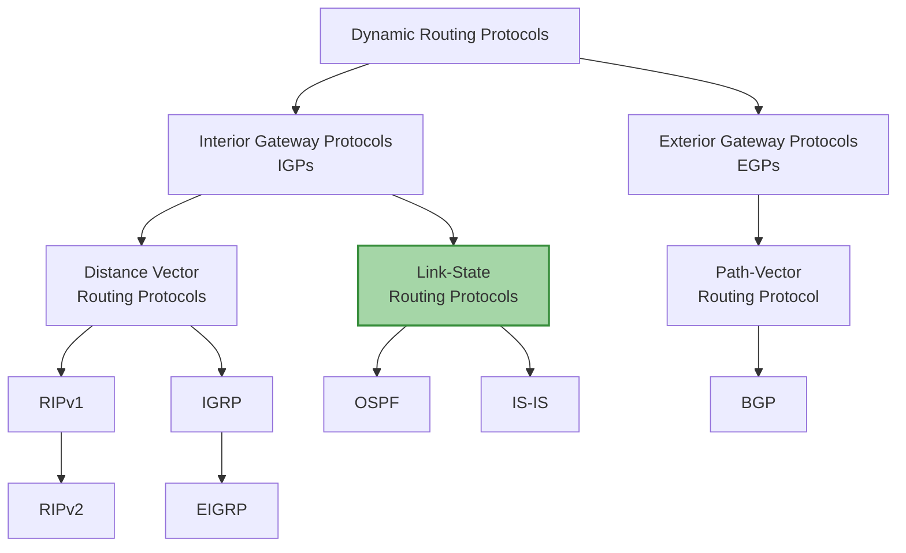

# Классификация протоколов маршрутизации

Рассматриваем протоколы состояния канала 

# Link-State Routing Protocols

## Link-State Routing Process

Каждый маршрутизатор, участвующий в процессе маршрутизации, используя протокол по состоянию канала:

1. Получает сведения о каждой из своих *непосредственно подключённых сетей*
2. Отвечает за отправку *hello-сообщений* соседним устройствам в рамках напрямую подключённых сетей
3. Создаёт *пакет состояния канала (LSP)*, в котором содержатся данные о состоянии каждого из напрямую подключённых каналов
4. Выполняет лавинную рассылку пакетов состояния канала всем соседним устройствам, которые затем сохраняют полученные пакеты в *базу данных*
5. Использует базу данных для создания общей *топологической схемы* и рассчитывает оптимальный путь к каждой сети назначения

Будем рассматривать работу протоколов состояния канала на примере следующей сети от лица маршрутизатора `R1`:

![[Pasted image 20251103211239.png]]

**Изучение непосредственно подключенных сетей**

При подключении `R1` пытается выяснить информацию о сетях, к которым он непосредственно подключен. А именно (основное):

- **Network** адрес и маску сети
- **IP address** свой IP-адрес в непосредственно подключенной сети
- **Type of network** тип сети (по типу среды*)
- **Cost of link** стоимость канала (задается автоматически, вычислением из пропускной способности канала, либо вручную)
- **Neighbors** IP-адреса соседних маршрутизаторов, работающих на том же протоколе маршрутизации и находящиесяв этой же сети

Для нахождения соседей маршрутизатор рассылает Hello сообщения во все интерфейсы, настроенные для работы протокола и дожидается ответа. Если ответ получен, считается, что сосед есть. В процессе работы протокола сообщения будут периодически отсылаться повторно. Если ответ не последует после нескольких отправок, считается, что сосед стал недоступен

После обнаружения всех соседей, маршрутизатор отправляет им List-State packets (LSP). В таких пакетах содержится (основное)

**LSP:**

- **Type of network** тип сети, к которой подключен маршрутизатор
- **Network** адрес и маска сети, к которой подключен маршрутизатор
- **Cost of link** стоимость канала, чтобы добраться до сообщаемой сети

На примере `R1`: **каждому** своему соседу (`R2`, `R3`, `R4`) `R1` отправит 4 LSP:

| LSP | Type of network       | Network     | Cost |
| --- | --------------------- | ----------- | ---- |
| 1   | Ethernet              | 10.1.0.0/16 | 2    |
| 2   | Serial point-to-point | 10.2.0.0/16 | 20   |
| 3   | Serial point-to-point | 10.3.0.0/16 | 5    |
| 4   | Serial point-to-point | 10.4.0.0/16 | 20   |

**Лавинная рассылка LSP**
- В свою очередь каждый маршрутизатор, получив LSP должен переслать этот пакет свои соседям (исключая соседа, от которого пришел LSP). В этом суть лавинной рассылки.
- Чтобы понимать, получал ли маршрутизатор пришедший LSP ранее, в LSP передается его порядковый номер и метка времени

>Такие правила гарантируют, что каждый маршрутизатор в сети получит информацию об изменении топологии сети, если она произошла

>Рассылка LSP создает большую нагрузку на сеть. Поэтому она делается не часто, а только при изменении топологии сети

**Обработка LSP**

Помимо рассылки LSP каждый маршрутизатор, получив LSP, сохраняет эту информацию в свою базу данных Link-State Database

## Link-State Database

В итоге после обмена LSP, каждый маршрутизатор владее информацию обо всех маршрутизаторах в сети и их связи между друг-другом. То есть имеет полную топологию сети. Эта информация хранится в *Link-State Database*

**На примере R1** его *Link-State Database* в "стабилизированном" (схождение протокола) состоянии выглядит следующим образом:

**R1 Link-states:**
- Connected to network 10.1.0.0/16, cost = 2
- Connected to R2 on network 10.2.0.0/16, cost = 20
- Connected to R3 on network 10.3.0.0/16, cost = 5
- Connected to R4 on network 10.4.0.0/16, cost = 20

**R2 Link-states:**
- Connected to network 10.5.0.0/16, cost = 2
- Connected to R1 on network 10.2.0.0/16, cost = 20
- Connected to R5 on network 10.9.0.0/16, cost = 10

**R3 Link-states:**
- Connected to network 10.6.0.0/16, cost = 2
- Connected to R1 on network 10.3.0.0/16, cost = 5
- Connected to R4 on network 10.7.0.0/16, cost = 10

**R4 Link-states:**
- Connected to network 10.8.0.0/16, cost = 2
- Connected to R1 on network 10.4.0.0/16, cost = 20
- Connected to R3 on network 10.7.0.0/16, cost = 10
- Connected to R5 on network 10.10.0.0/16, cost = 10

**R5 Link-states:**
- Connected to network 10.11.0.0/16, cost = 2
- Connected to R2 on network 10.9.0.0/16, cost = 10
- Connected to R4 on network 10.10.0.0/16, cost = 10

> Очевидно, что *Link-State Database* после схождения протокола должны совпадать на всех маршрутизаторах в сети

Далее на основе заполненной *Link-State Database* маршрутизатор строит топологию всей сети. После, используя топологию сети, заполняет свою таблицу маршрутизации

Для нахождения наикратчайших маршрутов, используется алгоритм SPF (на основе алгоритма Дейкстры)

## Преимущества и недостатки Link-State Routing Protocols

**Преимущества:**

- Каждый маршрутизатор выполняет построение собственной топологической карты сети, чтобы определить кратчайший путь
- Немедленная лавинная рассылка пакетов состояния канала позволяет добиться более быстрой сходимости
- Пакеты состояния канала (LSP) отправляются только в случае изменений в топологии и содержат только данные об этом изменении
- Иерархическая структура, используемая при внедрении структуры из нескольких *зон*

**Недостатки:** вытекают из преимуществ

- Для обслуживания базы данных состояний каналов и дерева кратчайших путей SPF требуются дополнительные ресурсы памяти
- Для расчета алгоритма поиска кратчайшего пути также требуются дополнительные ресурсы процессора
- Лавинная рассылка пакетов состояния канала может отрицательно сказаться на пропускной способности всей сети

## Иерархия Link-State

![[Pasted image 20251103220226.png]]

Чтобы не производить лавинную рассылку LSP по всей сети, протоколы Link-State поддерживают области (*area*). Вся сеть делится на области и только внутри области происходит рассылка LSP. Соответственно в каждой области формируется свой Link-State Database. Между областями передается лишь сжатая информация о топологии сети области

## Реализации List-State протоколов

- Только два протокола: Open Shortest Path First (*OSPF*) и Intermediate System to Intermediate System (*IS-IS*)
- OSPF разработан Internet Engineering Task Force (IETF) OSPF Working Group в 1987
- Есть две версии OSPF: OSPFv2 - OSPF для IPv4 сетей (RFC 1247 and RFC 2328) и OSPFv3 - OSPF для IPv6 сетей (RFC 2740)
- IS-IS разработан International Organization for Standardization (ISO)
- IS-IS описан в ISO 10589
- Радзия Перлман была главным дизайнером IS-IS
- Integrated IS-IS, или Dual IS-IS поддерживает IP-сети

Будем изучать только OSPF

# OSPF (Open Shortest Path First)

## Историческая справка

На данный момент существует 2 версии протокола:

- OSPFv2
- OSPFv3

Оба являются протоколами внутренней маршрутизации

>1 версия использовалась только в узких кругах разработки и не нашла широкого применения

- **1987** — начало разработки the Internet Engineering Task Force (IETF) OSPF Working Group
- **1989** — OSPFv1 в RFC 1131
- **1991** — OSPFv2 в RFC 1247
- **1998** — RFC 2328 (текущая версия OSPF)
- **1999** — OSPFv3 в RFC 2740
- **2008** — RFC 5340 (текущая версия OSPFv3)
- **2010** — RFC 5838 с поддержкой Address Families (AF)

Версия 2 используется для IPv4 сетей. Версия 3 - для IPv6 сетей. Во многом они похожи, поэтому рассматриваются вместе

## Компоненты OSPF

Присутствует небольшая аналогия с [[Сети. Лекция 15. EIGRP|EIGRP]] (но лучше на нее не опираться сильно):

| OSPF Database              | EIGRP Table    |
| -------------------------- | -------------- |
| Adjacency Database         | Neighbor Table |
| Link-state Database (LSDB) | Topology Table |
| Forwarding Database        | Routing Table  |

**Структуры данных:**
- **Adjacency database**(База данных смежности) создаёт таблицу соседей
- **Link-state database (LSDB)**(База данных состояния канала) создаёт таблицу топологии
- **Forwarding database**(База данных пересылки) создаёт таблицу маршрутизации

**Сообщения OSPF:**
- Hello packet
- Database description packet
- Link-state request packet
- Link-state update packet
- Link-state acknowledgment packet

При построении маршрутов Используется **SPF (алгоритм Дейкстры)**

## Принцип работы

### 1 Установление смежности с соседними маршрутизаторами путем отправки Hello пакетов

![[Pasted image 20251104014605.png]]

### 2 Обмен LSA

LSA(Link-State Advertisement) - сообщение о состоянии канала и его стоимости

![[Pasted image 20251104014931.png]]

Работает принцип [[#Link-State Routing Process|лавинной рассылки]]

### 3 Построение таблицы топологии LSDB

Параллельно с рассылками LSA происходит заполнение LSDB

![[Pasted image 20251104015157.png]]

### 4 Запуск алгоритма SPF и построение SPF-дерева

![[Pasted image 20251104015307.png]]

### 5 Лучший маршрут помещается в таблицу маршрутизации

![[Pasted image 20251104015408.png]]

## Single area и Multiarea OSPF

OSPF может работать в 2 режимах:

- Single area
- multiarea

Single area OSPF характерно, что каждый маршрутизатор в сети в своей LSDB имеет топологию **всей** настроенной сети (так как единственная область совпадает со всей сетью)

![[Pasted image 20251104015702.png]]

В multiarea OSPF вся сеть делится на отдельные области. Внутри одной области работает "обычный" single area OSPF. Однако между областями возможна связь

![[Pasted image 20251104015835.png]]

### Преимущества multiarea OSPF- Изменения в топологии значимы только внутри Area

- Меньший размер таблицы маршрутизации
- Уменьшается нагрузка на CPU и хранение обновлений link-state
- Уменьшается частота пересчёта SPF

## Типы пакетов OSPF

| Type | Packet Name                       | Комментарий                                                                          |
| ---- | --------------------------------- | ------------------------------------------------------------------------------------ |
| 1    | Hello                             | поиск соседей и поддержание смежности                                                |
| 2    | Database Description (DBD)        | сокращённый список базы данных (LSDB) состояний каналов отправляющего маршрутизатора |
| 3    | Link-State Request (LSR)          | запрос определённой информации из базы                                               |
| 4    | Link-State Update (LSU)           | ответ на LSR, а также распространение новой информации. 7 типов LSA                  |
| 5    | Link-State Acknowledgment (LSAck) | подтверждение на LSU                                                                 |

### Типы LSA сообщений

# LSA Type

| LSA Type  | Description                                               |
| --------- | --------------------------------------------------------- |
| 1         | Router LSAs                                               |
| 2         | Network LSAs                                              |
| 3, 4      | Summary LSAs                                              |
| 5         | Autonomous System External LSAs                           |
| 6         | Multicast OSPF LSAs                                       |
| 7         | Defined for Not-So-Stubby Areas                           |
| 8         | External Attributes LSA for Border Gateway Protocol (BGP) |
| 9, 10, 11 | Opaque LSAs                                               |

## Инкапсуляция OSPF сообщений

![[Pasted image 20251104021115.png]]
